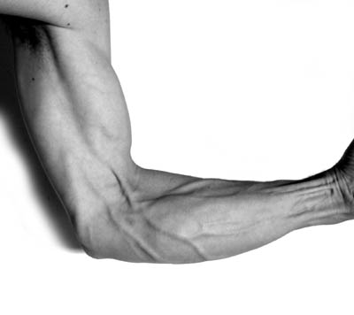

# Schmerzen im Bereich des Ellbogens

Fahre mit dem Mauszeiger über das schmerzhafte Areal und es erscheint eine Auswahl von möglichen Diagnosen, Infos und Tipps.

<h2>Vorderansicht</h2>

<map name="Map">
<area shape="poly" coords="80,267,96,275,124,287,140,288,139,270,131,252,109,242,84,237,70,233"
href="#" onclick="return false;"
onmouseover="showTooltip(el_01, event)" onmouseout="hideTooltip()">

<area shape="poly" coords="92,275,106,281,124,290,124,299,106,301,90,290,86,281,91,275"
href="#" onclick="return false;"
onmouseover="showTooltip(el_02, event)" onmouseout="hideTooltip()">

<area shape="poly" coords="100,167,128,242,136,253,151,250,177,239,149,202,148,163,132,88,131,80,77,98"
href="#" onclick="return false;"
onmouseover="showTooltip(el_03, event)" onmouseout="hideTooltip()">

<area shape="poly" coords="23,113,74,100,111,201,119,236,97,233,78,232,65,213"
href="#" onclick="return false;"
onmouseover="showTooltip(el_04, event)" onmouseout="hideTooltip()">

<area shape="poly" coords="154,207,181,236,201,242,222,251,235,209,172,191,153,187"
href="#" onclick="return false;"
onmouseover="showTooltip(el_05, event)" onmouseout="hideTooltip()">

<area shape="poly" coords="141,257,158,290,209,291,222,254,189,242,174,244"
href="#" onclick="return false;"
onmouseover="showTooltip(el_06, event)" onmouseout="hideTooltip()">

<area shape="poly" coords="237,213,214,291,319,267,303,209,272,210,240,215,275,239"
href="#" onclick="return false;"
onmouseover="showTooltip(el_07, event)" onmouseout="hideTooltip()">
</map>

<h2>Seitenansicht</h2>

<map name="Map2">
<area shape="poly" coords="325,57,375,109,360,144,312,175,277,176,253,186,244,180,262,161,280,108"
href="#" onclick="return false;"
onmouseover="showTooltip(el_08, event)" onmouseout="hideTooltip()">

<area shape="poly" coords="224,281,254,296,269,285,281,251,272,244,242,238,215,253"
href="#" onclick="return false;"
onmouseover="showTooltip(el_09, event)" onmouseout="hideTooltip()">

<area shape="poly" coords="255,191,285,211,280,240,246,233,216,240,194,231,194,190,195,176"
href="#" onclick="return false;"
onmouseover="showTooltip(el_10, event)" onmouseout="hideTooltip()">

<area shape="poly" coords="290,234,284,255,281,292,333,251,362,224,351,204,295,214"
href="#" onclick="return false;"
onmouseover="showTooltip(el_11, event)" onmouseout="hideTooltip()">

<area shape="poly" coords="217,301,245,315,272,308,272,291,253,301,241,292,222,284"
href="#" onclick="return false;"
onmouseover="showTooltip(el_12, event)" onmouseout="hideTooltip()">

<area shape="poly" coords="267,190,287,207,352,196,345,163,312,180,291,181"
href="#" onclick="return false;"
onmouseover="showTooltip(el_13, event)" onmouseout="hideTooltip()">

<area shape="poly" coords="350,163,364,216,394,184,396,140,376,135"
href="#" onclick="return false;"
onmouseover="showTooltip(el_14, event)" onmouseout="hideTooltip()">

<area shape="poly" coords="183,233,212,252,217,293,139,253,76,206,86,170,186,228"
href="#" onclick="return false;"
onmouseover="showTooltip(el_15, event)" onmouseout="hideTooltip()">

<area shape="poly" coords="6,102,22,85,44,104,30,112"
href="#" onclick="return false;"
onmouseover="showTooltip(el_16, event)" onmouseout="hideTooltip()">

<area shape="poly" coords="18,133,23,120,32,117,46,114,88,135,82,165,83,169,79,169,78,174"
href="#" onclick="return false;"
onmouseover="showTooltip(el_17, event)" onmouseout="hideTooltip()">

<area shape="poly" coords="188,222,188,174,93,137,89,161"
href="#" onclick="return false;"
onmouseover="showTooltip(el_18, event)" onmouseout="hideTooltip()">
</map>
