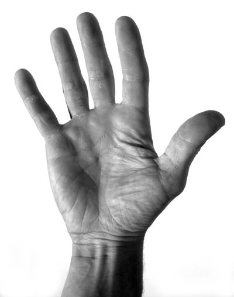
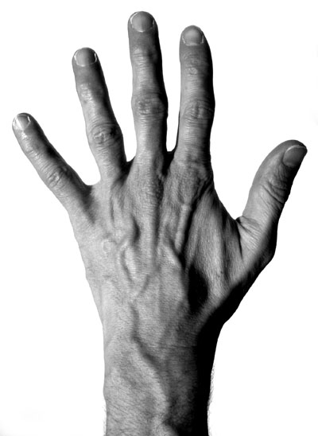

# Finger und Hand

Fahre mit dem Mauszeiger über das schmerzhafte Areal und es erscheint eine Auswahl von möglichen Diagnosen, Infos und Tipps.

<!-- KEIN overlib.js mehr – stattdessen mkdocs-kompatible Dateien -->
<!-- Die werden via mkdocs.yml extra_javascript geladen -->

<table width="100%" border="0">
  <tr>
    <td>
      
      <map name="P3_V">
                    <area shape="poly" coords="56,213,65,230,100,206,87,192" href="javascript:void(0);" onmouseover="{return overlib(ha_pip_p, STICKY, MOUSEOFF, WRAP, CELLPAD, 5, OFFSETX, 1, OFFSETY, 1);}" onmouseout="return nd();">
                    <area shape="poly" coords="32,134,29,153,35,168,66,149,54,131,41,127" href="javascript:void(0);" onmouseover="{return overlib(ha_p1_p, STICKY, MOUSEOFF, WRAP, CELLPAD, 5, OFFSETX, 1, OFFSETY, 1);}" onmouseout="return nd();">
                    <area shape="poly" coords="35,171,46,191,74,172,64,152" href="javascript:void(0);" onmouseover="{return overlib(ha_dip_p, STICKY, MOUSEOFF, WRAP, CELLPAD, 5, OFFSETX, 1, OFFSETY, 1);}" onmouseout="return nd();">
                    <area shape="poly" coords="67,235,82,257,116,237,97,209" href="javascript:void(0);" onmouseover="{return overlib(ha_p3, STICKY, MOUSEOFF, WRAP, CELLPAD, 5, OFFSETX, 1, OFFSETY, 1);}" onmouseout="return nd();">
                    <area shape="poly" coords="109,51,90,67,99,98,139,89,125,58" href="javascript:void(0);" onmouseover="{return overlib(ha_p1_p, STICKY, MOUSEOFF, WRAP, CELLPAD, 5, OFFSETX, 1, OFFSETY, 1);}" onmouseout="return nd();">
                    <area shape="poly" coords="156,23,139,33,142,50,149,69,186,56,172,26" href="javascript:void(0);" onmouseover="{return overlib(ha_p1_p, STICKY, MOUSEOFF, WRAP, CELLPAD, 5, OFFSETX, 1, OFFSETY, 1);}" onmouseout="return nd();">
                    <area shape="poly" coords="212,59,215,71,258,62,248,37,230,27,213,36" href="javascript:void(0);" onmouseover="{return overlib(ha_p1_p, STICKY, MOUSEOFF, WRAP, CELLPAD, 5, OFFSETX, 1, OFFSETY, 1);}" onmouseout="return nd();">
                    <area shape="poly" coords="107,129,145,117,152,140,113,152" href="javascript:void(0);" onmouseover="{return overlib(ha_p2, STICKY, MOUSEOFF, WRAP, CELLPAD, 5, OFFSETX, 1, OFFSETY, 1);}" onmouseout="return nd();">
                    <area shape="poly" coords="98,101,139,91,144,114,107,126" href="javascript:void(0);" onmouseover="{return overlib(ha_dip_p, STICKY, MOUSEOFF, WRAP, CELLPAD, 5, OFFSETX, 1, OFFSETY, 1);}" onmouseout="return nd();">
                    <area shape="poly" coords="149,75,187,60,196,91,153,98" href="javascript:void(0);" onmouseover="{return overlib(ha_dip_p, STICKY, MOUSEOFF, WRAP, CELLPAD, 5, OFFSETX, 1, OFFSETY, 1);}" onmouseout="return nd();">
                    <area shape="poly" coords="112,154,153,140,160,166,121,182" href="javascript:void(0);" onmouseover="{return overlib(ha_pip_p, STICKY, MOUSEOFF, WRAP, CELLPAD, 5, OFFSETX, 1, OFFSETY, 1);}" onmouseout="return nd();">
                    <area shape="poly" coords="123,187,135,222,167,209,161,170" href="javascript:void(0);" onmouseover="{return overlib(ha_p3, STICKY, MOUSEOFF, WRAP, CELLPAD, 5, OFFSETX, 1, OFFSETY, 1);}" onmouseout="return nd();">
                    <area shape="poly" coords="156,102,160,129,205,120,196,93" href="javascript:void(0);" onmouseover="{return overlib(ha_p2, STICKY, MOUSEOFF, WRAP, CELLPAD, 5, OFFSETX, 1, OFFSETY, 1);}" onmouseout="return nd();">
                    <area shape="poly" coords="162,134,207,124,211,155,166,164" href="javascript:void(0);" onmouseover="{return overlib(ha_pip_p, STICKY, MOUSEOFF, WRAP, CELLPAD, 5, OFFSETX, 1, OFFSETY, 1);}" onmouseout="return nd();">
                    <area shape="poly" coords="169,170,176,206,211,200,209,158" href="javascript:void(0);" onmouseover="{return overlib(ha_p3, STICKY, MOUSEOFF, WRAP, CELLPAD, 5, OFFSETX, 1, OFFSETY, 1);}" onmouseout="return nd();">
                    <area shape="poly" coords="216,74,259,66,263,94,217,100" href="javascript:void(0);" onmouseover="{return overlib(ha_dip_p, STICKY, MOUSEOFF, WRAP, CELLPAD, 5, OFFSETX, 1, OFFSETY, 1);}" onmouseout="return nd();">
                    <area shape="poly" coords="220,101,263,98,269,118,223,122" href="javascript:void(0);" onmouseover="{return overlib(ha_p2, STICKY, MOUSEOFF, WRAP, CELLPAD, 5, OFFSETX, 1, OFFSETY, 1);}" onmouseout="return nd();">
                    <area shape="poly" coords="224,126,227,154,271,159,270,120" href="javascript:void(0);" onmouseover="{return overlib(ha_pip_p, STICKY, MOUSEOFF, WRAP, CELLPAD, 5, OFFSETX, 1, OFFSETY, 1);}" onmouseout="return nd();">
                    <area shape="poly" coords="227,160,272,162,271,200,225,192" href="javascript:void(0);" onmouseover="{return overlib(ha_p3, STICKY, MOUSEOFF, WRAP, CELLPAD, 5, OFFSETX, 1, OFFSETY, 1);}" onmouseout="return nd();">
                    <area shape="poly" coords="85,260,121,237,136,223,173,209,212,203,229,196,270,204,277,237,219,240,183,247,149,264,129,277,90,295" href="javascript:void(0);" onmouseover="{return overlib(ha_mp_p, STICKY, MOUSEOFF, WRAP, CELLPAD, 5, OFFSETX, 1, OFFSETY, 1);}" onmouseout="return nd();">
                    <area shape="poly" coords="344,221,381,255,414,231,411,214,395,203,367,204" href="javascript:void(0);" onmouseover="{return overlib(ha_p1_p, STICKY, MOUSEOFF, WRAP, CELLPAD, 5, OFFSETX, 1, OFFSETY, 1);}" onmouseout="return nd();">
                    <area shape="poly" coords="341,223,378,260,357,292,314,252" href="javascript:void(0);" onmouseover="{return overlib(ha_dau_ip_p, STICKY, MOUSEOFF, WRAP, CELLPAD, 5, OFFSETX, 1, OFFSETY, 1);}" onmouseout="return nd();">
                    <area shape="poly" coords="314,258,354,297,349,307,340,347,315,371,279,305" href="javascript:void(0);" onmouseover="{return overlib(ha_dau_mp, STICKY, MOUSEOFF, WRAP, CELLPAD, 5, OFFSETX, 1, OFFSETY, 1);}" onmouseout="return nd();">
                    <area shape="poly" coords="119,405,162,404,169,438,131,437" href="javascript:void(0);" onmouseover="{return overlib(ha_pis, STICKY, MOUSEOFF, WRAP, CELLPAD, 5, OFFSETX, 1, OFFSETY, 1);}" onmouseout="return nd();">
                    <area shape="poly" coords="134,445,182,446,166,530,116,533" href="javascript:void(0);" onmouseover="{return overlib(ha_fcu, STICKY, MOUSEOFF, WRAP, CELLPAD, 5, OFFSETX, 1, OFFSETY, 1);}" onmouseout="return nd();">
                    <area shape="poly" coords="189,446,231,445,227,535,173,530" href="javascript:void(0);" onmouseover="{return overlib(ha_fcr, STICKY, MOUSEOFF, WRAP, CELLPAD, 5, OFFSETX, 1, OFFSETY, 1);}" onmouseout="return nd();">
                    <area shape="poly" coords="194,439,232,443,258,438,276,420,253,402,223,410" href="javascript:void(0);" onmouseover="{return overlib(ha_scaph, STICKY, MOUSEOFF, WRAP, CELLPAD, 5, OFFSETX, 1, OFFSETY, 1);}" onmouseout="return nd();">
                    <area shape="poly" coords="126,286,166,260,217,243,275,245,281,280,235,312,211,344,211,390,211,415,195,432,173,435,165,366,154,317" href="javascript:void(0);" onmouseover="{return overlib(ha_mc_p, STICKY, MOUSEOFF, WRAP, CELLPAD, 5, OFFSETX, 1, OFFSETY, 1);}" onmouseout="return nd();">
                    <area shape="poly" coords="89,301,124,294,152,319,163,388,163,401,118,402,102,363" href="javascript:void(0);" onmouseover="{return overlib(ha_hythe, STICKY, MOUSEOFF, WRAP, CELLPAD, 5, OFFSETX, 1, OFFSETY, 1);}" onmouseout="return nd();">
                    <area shape="poly" coords="236,449,265,448,264,531,232,535" href="javascript:void(0);" onmouseover="{return overlib(ha_styra, STICKY, MOUSEOFF, WRAP, CELLPAD, 5, OFFSETX, 1, OFFSETY, 1);}" onmouseout="return nd();">
                    <area shape="poly" coords="215,402,255,398,277,414,310,377,296,338,272,310,254,308,237,314,214,349" href="javascript:void(0);" onmouseover="{return overlib(ha_the, STICKY, MOUSEOFF, WRAP, CELLPAD, 5, OFFSETX, 1, OFFSETY, 1);}" onmouseout="return nd();">
                    <area shape="poly" coords="48,194,55,210,85,191,75,174" href="javascript:void(0);" onmouseover="{return overlib(ha_p2, STICKY, MOUSEOFF, WRAP, CELLPAD, 5, OFFSETX, 1, OFFSETY, 1);}" onmouseout="return nd();">
                </map>
    </td>
  </tr>
</table>

<table width="100%" border="0">
  <tr>
    <td>
      
      <map name="Map2">
                    <area shape="poly" coords="238,30,226,45,223,61,264,58,255,36" href="javascript:void(0);" onmouseover="{return overlib(ha_p1_d, STICKY, MOUSEOFF, WRAP, CELLPAD, 5, OFFSETX, 1, OFFSETY, 1);}" onmouseout="return nd();">
                    <area shape="poly" coords="14,156,19,172,47,156,33,140" href="javascript:void(0);" onmouseover="{return overlib(ha_p1_d, STICKY, MOUSEOFF, WRAP, CELLPAD, 5, OFFSETX, 1, OFFSETY, 1);}" onmouseout="return nd();">
                    <area shape="poly" coords="106,57,89,69,91,102,127,89,121,69" href="javascript:void(0);" onmouseover="{return overlib(ha_p1_d, STICKY, MOUSEOFF, WRAP, CELLPAD, 5, OFFSETX, 1, OFFSETY, 1);}" onmouseout="return nd();">
                    <area shape="poly" coords="175,14,161,27,165,48,200,45,190,15" href="javascript:void(0);" onmouseover="{return overlib(ha_p1_d, STICKY, MOUSEOFF, WRAP, CELLPAD, 5, OFFSETX, 1, OFFSETY, 1);}" onmouseout="return nd();">
                    <area shape="poly" coords="238,30,226,45,223,61,264,58,255,36" href="#">
                    <area shape="poly" coords="336,194,371,220,390,187,368,172,355,178" href="javascript:void(0);" onmouseover="{return overlib(ha_p1_d, STICKY, MOUSEOFF, WRAP, CELLPAD, 5, OFFSETX, 1, OFFSETY, 1);}" onmouseout="return nd();">
                    <area shape="poly" coords="23,177,38,201,65,184,48,159" href="javascript:void(0);" onmouseover="{return overlib(ha_dip_d, STICKY, MOUSEOFF, WRAP, CELLPAD, 5, OFFSETX, 1, OFFSETY, 1);}" onmouseout="return nd();">
                    <area shape="poly" coords="45,211,70,244,97,215,70,188" href="javascript:void(0);" onmouseover="{return overlib(ha_pip_d, STICKY, MOUSEOFF, WRAP, CELLPAD, 5, OFFSETX, 1, OFFSETY, 1);}" onmouseout="return nd();">
                    <area shape="poly" coords="95,110,129,96,139,127,103,139" href="javascript:void(0);" onmouseover="{return overlib(ha_dip_d, STICKY, MOUSEOFF, WRAP, CELLPAD, 5, OFFSETX, 1, OFFSETY, 1);}" onmouseout="return nd();">
                    <area shape="poly" coords="108,151,143,143,158,187,116,198" href="javascript:void(0);" onmouseover="{return overlib(ha_pip_d, STICKY, MOUSEOFF, WRAP, CELLPAD, 5, OFFSETX, 1, OFFSETY, 1);}" onmouseout="return nd();">
                    <area shape="poly" coords="163,62,200,60,204,97,166,97" href="javascript:void(0);" onmouseover="{return overlib(ha_dip_d, STICKY, MOUSEOFF, WRAP, CELLPAD, 5, OFFSETX, 1, OFFSETY, 1);}" onmouseout="return nd();">
                    <area shape="poly" coords="167,115,208,115,209,159,166,162" href="javascript:void(0);" onmouseover="{return overlib(ha_pip_d, STICKY, MOUSEOFF, WRAP, CELLPAD, 5, OFFSETX, 1, OFFSETY, 1);}" onmouseout="return nd();">
                    <area shape="poly" coords="227,72,267,72,267,103,230,104" href="javascript:void(0);" onmouseover="{return overlib(ha_dip_d, STICKY, MOUSEOFF, WRAP, CELLPAD, 5, OFFSETX, 1, OFFSETY, 1);}" onmouseout="return nd();">
                    <area shape="poly" coords="232,116,270,117,269,166,225,160" href="javascript:void(0);" onmouseover="{return overlib(ha_pip_d, STICKY, MOUSEOFF, WRAP, CELLPAD, 5, OFFSETX, 1, OFFSETY, 1);}" onmouseout="return nd();">
                    <area shape="poly" coords="76,254,110,232,126,222,164,207,192,187,228,191,265,194,269,237,212,241,168,254,136,274,97,296" href="javascript:void(0);" onmouseover="{return overlib(ha_mp_d, STICKY, MOUSEOFF, WRAP, CELLPAD, 5, OFFSETX, 1, OFFSETY, 1);}" onmouseout="return nd();">
                    <area shape="poly" coords="371,225,332,200,317,238,357,260" href="javascript:void(0);" onmouseover="{return overlib(ha_dau_ip_d, STICKY, MOUSEOFF, WRAP, CELLPAD, 5, OFFSETX, 1, OFFSETY, 1);}" onmouseout="return nd();">
                    <area shape="poly" coords="352,266,347,314,324,345,299,305,304,272,319,246" href="javascript:void(0);" onmouseover="{return overlib(ha_dau_mp, STICKY, MOUSEOFF, WRAP, CELLPAD, 5, OFFSETX, 1, OFFSETY, 1);}" onmouseout="return nd();">
                    <area shape="poly" coords="273,452,242,452,237,546,266,547" href="javascript:void(0);" onmouseover="{return overlib(ha_styra, STICKY, MOUSEOFF, WRAP, CELLPAD, 5, OFFSETX, 1, OFFSETY, 1);}" onmouseout="return nd();">
                    <area shape="poly" coords="131,458,174,458,174,493,134,506" href="javascript:void(0);" onmouseover="{return overlib(ha_cap_ul, STICKY, MOUSEOFF, WRAP, CELLPAD, 5, OFFSETX, 1, OFFSETY, 1);}" onmouseout="return nd();">
                    <area shape="poly" coords="134,550,136,510,172,500,171,547" href="javascript:void(0);" onmouseover="{return overlib(ha_ecu, STICKY, MOUSEOFF, WRAP, CELLPAD, 5, OFFSETX, 1, OFFSETY, 1);}" onmouseout="return nd();">
                    <area shape="poly" coords="225,447,271,446,271,446,298,381,260,346,240,350,224,426" href="javascript:void(0);" onmouseover="{return overlib(ha_scaph, STICKY, MOUSEOFF, WRAP, CELLPAD, 5, OFFSETX, 1, OFFSETY, 1);}" onmouseout="return nd();">
                    <area shape="poly" coords="223,447,177,451,178,412,227,408,221,431" href="javascript:void(0);" onmouseover="{return overlib(ha_sl_lu, STICKY, MOUSEOFF, WRAP, CELLPAD, 5, OFFSETX, 1, OFFSETY, 1);}" onmouseout="return nd();">
                    <area shape="poly" coords="128,401,172,414,175,454,130,454" href="javascript:void(0);" onmouseover="{return overlib(ha_tfcc, STICKY, MOUSEOFF, WRAP, CELLPAD, 5, OFFSETX, 1, OFFSETY, 1);}" onmouseout="return nd();">
                    <area shape="poly" coords="178,462,236,452,234,542,172,541" href="javascript:void(0);" onmouseover="{return overlib(ha_4ss, STICKY, MOUSEOFF, WRAP, CELLPAD, 5, OFFSETX, 1, OFFSETY, 1);}" onmouseout="return nd();">
                    <area shape="poly" coords="236,352,181,369,124,376,129,391,174,407,225,401" href="javascript:void(0);" onmouseover="{return overlib(ha_midc, STICKY, MOUSEOFF, WRAP, CELLPAD, 5, OFFSETX, 1, OFFSETY, 1);}" onmouseout="return nd();">
                    <area shape="poly" coords="101,303,129,373,230,347,264,336,305,379,320,353,296,309,270,247,215,249,157,264" href="javascript:void(0);" onmouseover="{return overlib(ha_mc_d, STICKY, MOUSEOFF, WRAP, CELLPAD, 5, OFFSETX, 1, OFFSETY, 1);}" onmouseout="return nd();">
                </map>
    </td>
  </tr>
</table>

