# Schulterschmerz beim Klettern – was tun?

## Typische Beschwerden

- Schulterschmerzen beim oder nach dem Klettern  
  (z.B. im Untergriff oder beim Halten von Griffen über Kopfhöhe)
- Schmerzen beim Hochheben des Armes und beim Heben von Gegenständen über Kopfhöhe
- Kein Unfallereignis (z.B. Ausrenkung, Verrenkung, Sturz)

---

## Ursache der Beschwerden

| 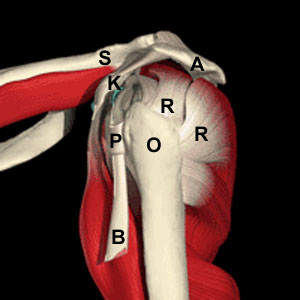 |
|:--:|
| Anatomie der Schulter |

Da die Gelenkpfanne der Schulter relativ klein ist (im Gegensatz zum Hüftgelenk), ist der umgebende Muskelgürtel – die **R**otatorenmanschette – dafür verantwortlich, dass der **O**berarmkopf ständig in Kontakt mit der Gelenkpfanne bleibt.

Die Ursache der Beschwerden ist meistens eine muskuläre Imbalance. Diese führt zu einer leichten Dezentrierung des **O**berarmkopfes aus der Pfanne. Dadurch kommt es zu einer Einklemmung von Weichteilstrukturen zwischen dem **O**berarmkopf und angrenzenden Knochen- und Bandstrukturen (**S**chlüsselbein, Schulterblatt, **A**cromion, **k**orakoakromiales Band).

Meistens wird durch die Quetschung der **R**otatorenmanschette und der **B**izepssehne der Schmerz verursacht. Durch eine Auslockerung des Führungskanals der Bizepssehne (**P**ulley) kann zusätzlich Schmerz entstehen, häufig verbunden mit Kraftlosigkeit und Instabilität.

Falls diese Strukturen noch nicht beschädigt sind, können die Beschwerden mit gezieltem Krafttraining und kletterspezifischen Zentrierungsübungen behoben werden. Bei Verdacht auf eine strukturelle Läsion sollte eine Abklärung mittels Ultraschall oder MRT erfolgen.

---

## Krafttraining bei Schulterbeschwerden

Beim Klettern werden im Schulterbereich vor allem die **Innendreher (Innenrotatoren)** und die **Hochabspreizer (Hochabduktoren)** trainiert.  

Die **Aussendreher (Aussenrotatoren)** und die **Beuger (Flektoren)** zeigen hingegen häufig ein Defizit.

Die folgenden Übungen dienen dazu, diese muskulären Ungleichgewichte auszugleichen.

> **Wichtig bei allen Übungen:**  
> Der Oberarmkopf muss konsequent zentriert werden.  
> Das heisst: bewusst *fusswärts* und *rückenwärts* positionieren.

---

## 1. Schulterabduktion mit Hantel

Diese Übung wird mit Hanteln durchgeführt. Die Oberarme befinden sich in Innendrehung (Handrücken zeigt zur Decke), wodurch eine Umlenkung am Pulley und eine Reizung der Bizepssehne verhindert wird.

Das Abspreizen (Abduktion) erfolgt mit ca. 30° nach vorne gehaltenen Armen. Dadurch werden die Scherkräfte im Schultergelenk möglichst klein gehalten, da die Gelenkpfannen im Körper ebenfalls etwa 30° nach vorne gedreht sind.

Die Übung sollte vor dem Spiegel durchgeführt werden, um ein konsequentes Tiefstellen des Oberarmkopfes sicherzustellen.

|  | 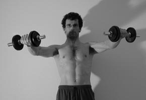 |
|:--:|:--:|
| Startposition | Bewegung |

| 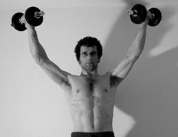 | 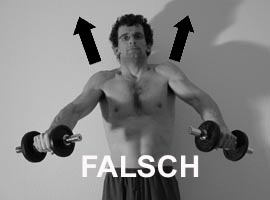 |
|:--:|:--:|
| Endposition | häufige Fehlerquelle |

**Belastung:**

- 10–15 Wiederholungen  
- 4–6 Serien  
- 3x pro Woche  
- langsam und kontrolliert

---

## 2. Schulterabduktion mit Theraband

Diese Übung kann alternativ mit einem Theraband durchgeführt werden, welches z.B. an einer Türklinke befestigt wird.

Auch hier sollte die Übung vor dem Spiegel erfolgen, um die Zentrierung des Oberarmkopfes kontrollieren zu können.

| 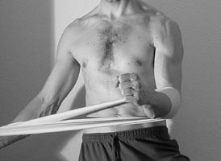 | 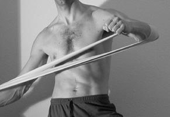 |
|:--:|:--:|
| Startposition | Bewegung |

| 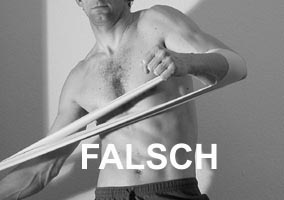 |
|:--:|
| häufige Fehlerquelle |

**Belastung:**

- 10–15 Wiederholungen  
- 4–6 Serien  
- 3x pro Woche  

---

## 3. Schulteraussenrotation (Ausserotation)

Die Übung wird mit einem Theraband durchgeführt, das an einer Türklinke befestigt wird.  

Mit am Oberkörper angelegtem Arm wird die Schulter gegen Widerstand nach aussen rotiert.

Die Übung sollte ebenfalls vor dem Spiegel erfolgen, um die Zentrierung des Oberarmkopfes sicherzustellen.

| 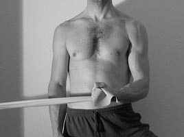 | 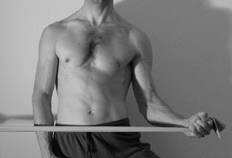 |
|:--:|:--:|
| Startposition | Bewegung |

| 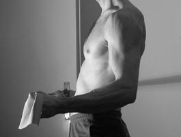 |
|:--:|
| korrekte Endposition |

**Belastung:**

- 10–15 Wiederholungen  
- 4–6 Serien  
- 3x pro Woche  

---

## 4. Schulterstreckung (Extension)

Diese Übung wird ebenfalls mit dem Theraband durchgeführt, welches vor dem Trainierenden befestigt wird.

Der gestreckte Arm wird gegen Widerstand nach hinten geführt.

| 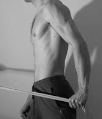 | 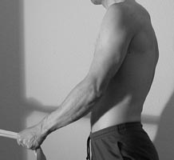 |
|:--:|:--:|
| Startposition | Bewegung |

**Belastung:**

- 10–15 Wiederholungen  
- 4–6 Serien  
- 3x pro Woche  

---

## 5. Paralleles Schulterhochwegspreizen (Hochabduktion)

Diese Übung kann symmetrisch oder asymmetrisch (links oben oder rechts oben) durchgeführt werden. Alle drei Varianten sollten trainiert werden.

Sie ist für die kletterspezifische Stabilisation der Schulter sehr effizient.

Gestartet wird mit parallelen Armen, gefolgt von langsamem symmetrischem oder asymmetrischem Abspreizen. Insbesondere hier muss streng auf das Tiefhalten des Oberarmkopfes geachtet werden.

| 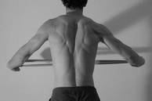 | 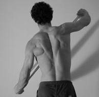 | 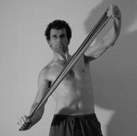 |
|:--:|:--:|:--:|
| symmetrisch | asymmetrisch links | asymmetrisch rechts |

**Belastung:**

- 10–15 Wiederholungen  
- 4–6 Serien  
- 3x pro Woche  
