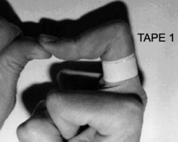
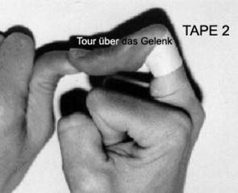
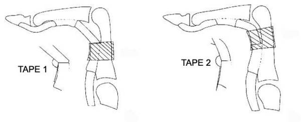

# Taping des A2 Ringbandes

Zirkuläres (ringförmiges) Taping im Bereich des Fingergrundgliedes wird von Kletterern häufig angewandt, um eine Beugesehnenscheidenentzündung, einen Teil- oder Komplettriss des A2-Ringbandes zu behandeln oder einer Verletzung vorzubeugen.

Mit der Absicht, die biomechanische Effektivität eines solchen Ringband-Tapings zu beurteilen, wurde die folgende Studie durchgeführt. Hierfür wurden Messgeräte konstruiert, um das Ausmass des physiologisch vorkommenden Bowstringings (Bogensehneneffekt, Abheben der Beugesehne vom Grundglied) sowie die Kraft des Bowstringings (Kraft der Beugesehne, die auf das Ringband wirkt) mit und ohne Taping zu bestimmen.

Zwei verschiedene Taping-Techniken wurden untersucht:

- **Tape 1:** in der Mitte des Grundgliedes  
- **Tape 2:** direkt anschliessend an das Fingermittelgelenk  

Untersucht wurden 16 Ring- oder Mittelfinger in der für Kletterer typischen aufgestellten Fingerposition (ca. 100° Beugung im Fingermittelgelenk und Überstreckung im Fingerendgelenk).

---

Das Taping im Bereich der Mitte des Grundgliedes (Tape 1, vorderes Ende des A2-Ringbandes) verminderte das Bowstringing um **2,8 %** und absorbierte **11 %** der auf das Ringband wirkenden Kraft.

Das Taping direkt im Anschluss an das Fingermittelgelenk (Tape 2) verminderte das Bowstringing um **22 %** und absorbierte **12 %** der auf das Ringband wirkenden Kraft.

Ein zirkuläres (ringförmiges) Taping ist aufgrund dieser Resultate nur minimal effektiv, um die auf das Ringband wirkende Kraft zu reduzieren. Es ist sehr unwahrscheinlich, dass eine präventive Wirkung erzielt werden kann.

Falls dennoch ein Taping angewandt wird, sollte es **direkt anschliessend an das Fingermittelgelenk** angebracht werden (siehe Tape 2). Dadurch kann die Umlenkung der Beugesehne teilweise vom Tape übernommen werden.

Zusätzlich kann eine Tour über das Mittelgelenk selbst (bei ca. 45° gebeugtem Gelenk) geführt werden. Diese Schlaufe verstärkt den Zug zusätzlich beim Einnehmen der aufgestellten Fingerposition.

---

Diese Untersuchung wurde im *Journal of Hand Surgery* publiziert.
