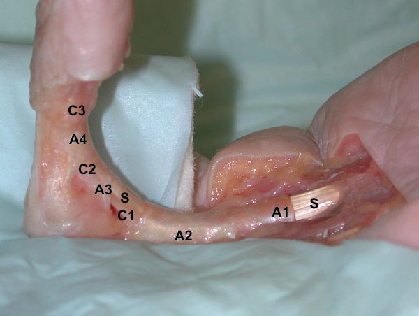
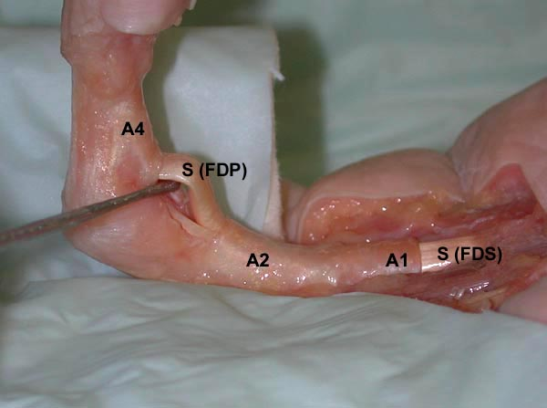
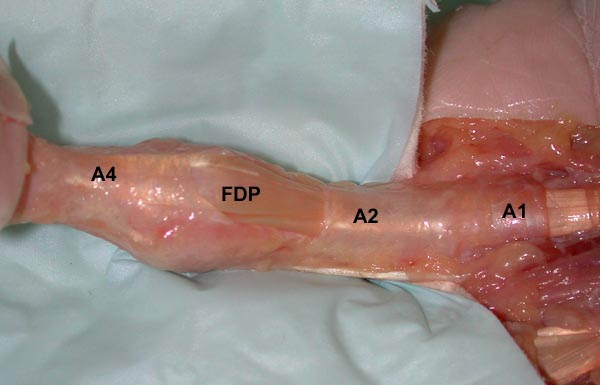
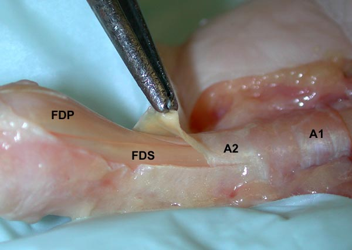
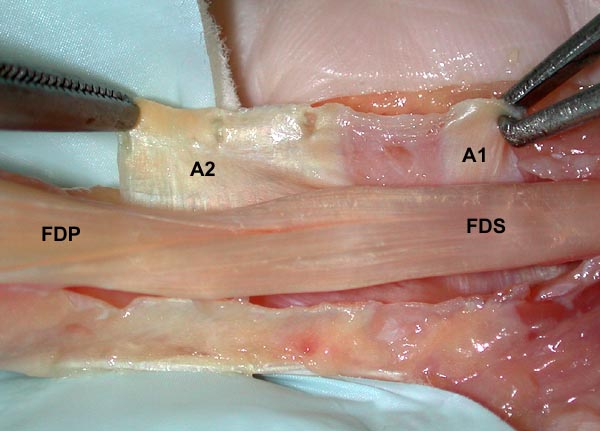
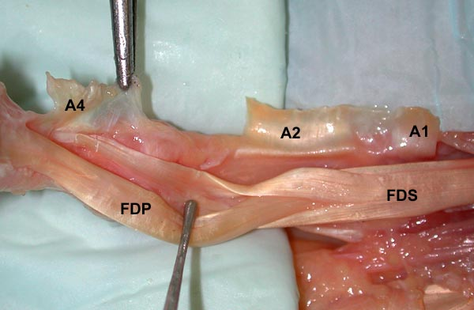
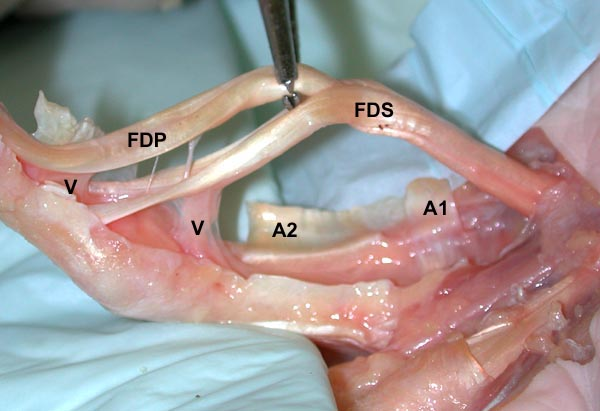
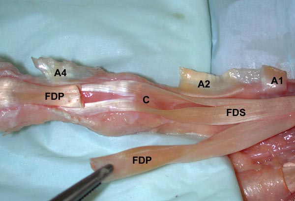
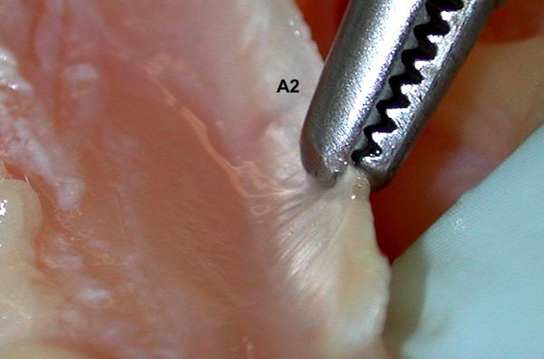

# The A2 pulley and the flexor tendon sheath

Anatomical preparation of a finger specimen is used to explain the anatomy and give an impression of the function and concept of the flexor tendon sheath and its pulley system particularly the A2 pulley. The pulley system, the flexor tendons and the finger bones represent a functional unit which enables the finger to be bent.

The preparation below shows a right middle finger, where soft tissue like skin, vessels, nerves and subcutaneous fat has been removed except of the tip of the finger. The whole flexor tendon sheath is shown and represents a tunnel surrounding the tendons (**S**). The sheath has the function to keep the tendons next to the bone if they are under tension. Four of the five annular pulleys (**A1–A4**) as well as the three cruciate pulleys (**C1–C3**) are marked.

---

The next picture shows the situation with the A3 pulley removed, the deep flexor tendon (**FDP**, flexor digitorum profundus) is lifted by tweezers. It lies at the finger middle joint (PIP, proximal interphalangeal joint) in a superficial position after piercing the superficial flexor tendon (**FDS**, flexor digitorum superficialis).

The FDP tendon inserts at the terminal bone of the finger (distal phalanx) and flexes both the middle (PIP joint) as well as the terminal finger joint (DIP, distal interphalangeal joint). The FDS tendon inserts at the middle bone of the finger and flexes the middle finger joint (PIP joint).

From a functional point of view the **A2** and the **A4** pulleys are of utmost importance concerning strength and range of motion of finger flexion. Cutting the A2 pulley impairs range of motion more, whereas cutting the A4 pulley mainly reduces strength.

---

In the extended finger the increased structural thickness of the **A1**, **A2** and **A4** pulleys is well visible. The deep flexor tendon (**FDP**) lies superficially in the area of the middle finger joint.

At the distal (left) edge of the A2 pulley, the greatest amount of force is diverted during finger flexion. This is the site where, during crimp grip position in rock climbers, most injuries and overuse syndromes occur.

---

The picture shows the situation after partial cutting the distal part of the A2 pulley, which is lifted by tweezers. The 1–2 mm thick and very stable structure of the A2 pulley is well visible, showing fibres running perpendicular to the flexor tendons.

The inner surface of the pulley is lined by microgrooves containing cartilage-like cells. These are able to bear the high compressive forces occurring during power grip.

---

The whole **A2** and **A1** pulleys are cut. Again, the perpendicular direction of the fibres of the pulley is visible.

During power grip, such as the crimp grip position in rock climbers, the microgrooves of the inner lining of the pulley cause considerable friction against the deep flexor tendon (**FDP**), accounting for about 10 % of eccentric grip strength.

In bats, this structure is developed in such a way that very high friction locks the tendon in a flexed position, enabling bats to hang freely on their fingers without active muscle force.

The superficial flexor tendon (**FDS**) is split just under the A2 pulley and pierced by the **FDP** tendon.

---

The next preparation step shows the **A1–A4** pulleys cut. The **FDP** tendon is held apart so that the crossing fibres (Camper’s Chiasma) of the **FDS** tendon are well visible.

---

The **FDP** and **FDS** tendons are lifted. It is clearly visible how the FDP tendon pierces the FDS tendon.

At the site of tendon insertion, the so-called vinculae (**V**) are visible. They supply blood vessels to the tendon and are mainly responsible for the nutrition of the flexor tendons.

---

The **FDP** tendon has been cut at the middle finger bone and pulled back through the **FDS** tendon slip. This demonstrates how the FDP tendon is surrounded by the FDS tendon and how the fibres cross again at Camper’s Chiasma.

This FDS sling contracts during muscular activity, stabilizes the FDP tendon, and acts as a flexing force in the middle finger joint. The complementary shape of the two tendons is clearly visible.

---

The **A2 pulley** again in detail. The fibre insertions into the bone (Sharpey’s fibres) are shown. They run perpendicular to the direction of the flexor tendons.

The interaction between the A2 pulley and the flexor tendons is of crucial importance during the crimp grip position in rock climbers.

