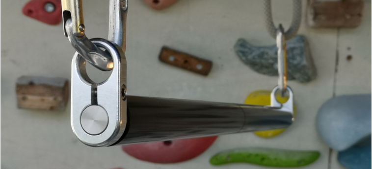

# TURNTILLBURN

> Reduziert auf das Wesentliche.  
> Ein Trainingsgerät für Kletterer und Klettererinnen, die Belastung bewusst steuern wollen.

<iframe
  width="100%"
  height="450"
  src="https://www.youtube.com/embed/XYdTQooAyuk?loop=1&playlist=XYdTQooAyuk"
  title="Produktvideo"
  frameborder="0"
  allow="accelerometer; autoplay; clipboard-write; encrypted-media; gyroscope; picture-in-picture; web-share"
  allowfullscreen>
</iframe>

## Warum TURNTILLBURN?

TURNTILLBURN wurde entwickelt für Situationen, in denen **gezieltes Training** gefragt ist:  
wenn du reproduzierbar trainieren willst, ohne dass Haut, Griffstruktur oder Zufall zuerst limitieren.

Es ersetzt das Klettern am Fels nicht –  
aber es ist ein Werkzeug, um **kontrolliert bis an die Belastungsgrenze** zu gehen.

---

## Kurzüberblick

- **Zweck:** dosierbares Finger- und Unterarmtraining  
- **Training:** hautschonend, kontrolliert, reproduzierbar  
- **Philosophie:** kein Ersatz für den Fels – aber das richtige Tool für gezielte Belastung

> **Hinweis:** TURNTILLBURN ist kein medizinisches Produkt.  
> Die Montage ist **Sache der Benutzer und Benutzerinnen**.

---

## Für wen ist das Gerät geeignet?

- Klettererinnen, die ihre Trainingsbelastung **gezielt dosieren** wollen  
- Trainer, die Einheiten **reproduzierbar** gestalten möchten  
- Athletinnen, die tranieren wollen «bis es brennt».  

---

## Zwei Gerätetypen

- TURNTILLBURN Free
- TURNTILLBURN Sync

---

### TURNTILLBURN Free

Beim **TURNTILLBURN Free** arbeiten beide Hände auf zwei getrennten Rohren.

Jedes Rohr ist auf zwei Rillenkugellagern gelagert.  
Insgesamt sind somit vier Lager verbaut.

Die beiden Rohre sind mechanisch nicht miteinander verbunden.  
Jede Hand erzeugt und kontrolliert ihre Rotation unabhängig.

Biomechanisch bedeutet dies:

- Jede Hand muss die Kraft selbstständig aufbauen.  
- Seitendifferenzen werden unmittelbar sichtbar und spürbar.  
- Eine dominante Seite kann die andere nicht mechanisch mitziehen.  
- Die neuromuskuläre Ansteuerung erfolgt differenziert für beide Hände.  

Da beim Klettern selten symmetrische Belastungssituationen vorliegen, kommt **TURNTILLBURN** Free der realen Beanspruchung nahe.

**TURNTILLBURN Free** stellt höhere koordinative Anforderungen als **TURNTILLBURN Sync** (siehe unten) und erlaubt eine präzise Dosierung der linken resp. rechten Hand.

---

### TURNTILLBURN Sync

Beim **TURNTILLBURN Sync** arbeiten beide Hände auf einem durchgehenden Rohr.

Das Rohr ist auf zwei Rillenkugellagern gelagert.

Die Rotation erfolgt als geschlossene Einheit.  
Beide Hände bewegen denselben Rollkörper.

Die Kraftübertragung ist mechanisch gekoppelt.  
Eine Seite kann die andere unterstützen oder stabilisieren.

**TURNTILLBURN Sync** vermittelt ein ruhiges und stabiles Bewegungsgefühl und ist koordinativ einfacher.

---

## Wahl des Gerätetyps

Die Wahl zwischen **TURNTILLBURN Free** und **TURNTILLBURN Sync** richtet sich nach persönlicher Präferenz, Trainingsziel und Einsatzbereich.

Beide Typen basieren auf derselben konstruktiven Grundlage und erfüllen dieselben Anforderungen hinsichtlich Materialqualität, Lagerung und Fertigungspräzision.

