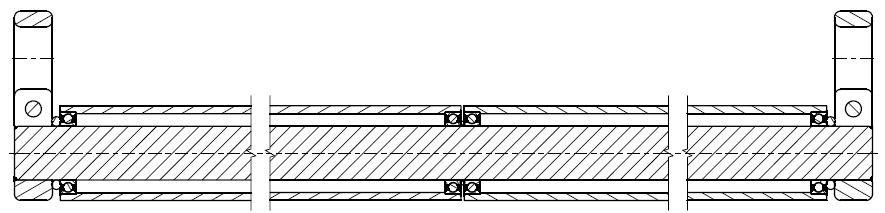
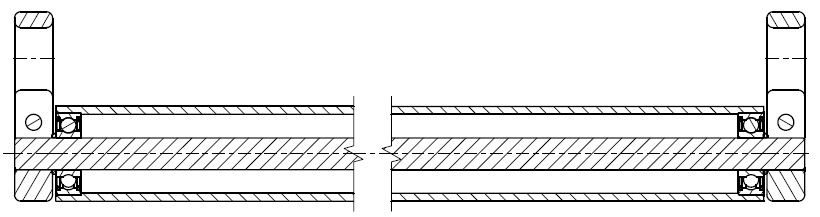

# **Pläne**

## Offenheit

Wir stellen die Konstruktionspläne des **TURNTILLBURN** frei zur Verfügung.

Der Käufer soll nachvollziehen können, wie das Gerät aufgebaut ist –  
Materialien, Lagerung, Toleranzen und Oberflächen sind vollständig dokumentiert.

Wer über die entsprechenden technischen Möglichkeiten verfügt, kann das Gerät auf dieser Grundlage auch selbst fertigen.

Das **TURNTILLBURN** ist kein Produkt, das von Geheimhaltung lebt.  
Seine Qualität liegt in der funktionalen und mechanischen Ausführung.
---
## Konstruktion

Die Konstruktion erfolgte in Zusammenarbeit mit der Schweizer Firma <a href="https://www.diagonal-mechanik.ch/" 
   target="_blank" 
   rel="noopener">
<strong>Diagonal Mechanik</strong></a>, Urdorf. Die technische Entwicklung wurde gemeinsam mit **Fabian Sigwart** erarbeitet.

Die vorliegenden Zeichnungen entsprechen industriellen Fertigungsunterlagen mit vollständigen Material-, Lager- und Toleranzangaben.

---
## [**TURNTILLBURN Free**](../order/#turntillburn-free)
<small>(zwei getrennte Rohre)</small>

- [DP101-Baugruppe.pdf](DP101_A_Klimmzugstange_Doppelt.pdf)
- [DP001-Rundstange.pdf](DP001_A_Rundstange.pdf)
- [DP002-Halter.pdf](DP002_A_Halter.pdf)
- [DP003-Rohr.pdf](DP003_A_Rohr.pdf)

---

## [**TURNTILLBURN Sync**](../order/#turntillburn-sync)
<small>(ein durchgehendes Rohr)</small>

- [EF101-Baugruppe.pdf](EF101_A_Klimmzugstange_Einfach.pdf)
- [EF001-Rundstange.pdf](EF001_A_Rundstange.pdf)
- [EF002-Halter.pdf](EF002_A_Halter.pdf)
- [EF003-Rohr.pdf](EF003_A_Rohr.pdf)

---

